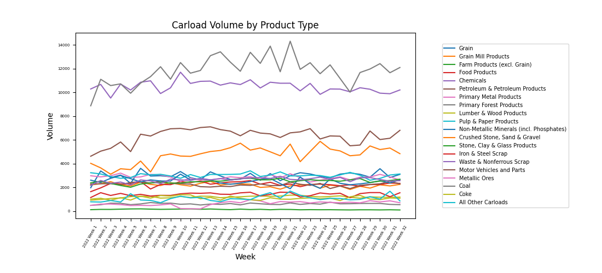

# Railroad Volume Data Scraping

A historical Python data-engineering project from 2022 that collected weekly CSX rail-volume reports, extracted PDF tables, cleaned the results, and visualized product-volume trends.

## Portfolio role

This repository is retained as a **historical data-workflow example**, not as a current production scraper. Its value is the end-to-end pipeline:

1. discover dynamically rendered report links,
2. extract tabular data from PDFs,
3. clean and normalize weekly values,
4. aggregate time-series data,
5. generate comparative plots.

The original implementation reflects the tooling and source-page structure available in 2022. It is intentionally not presented as a maintained live feed.

## Repository layout

- `rram_webscrape.py` — primary historical scraping/analysis script.
- `archive/rram_webscrape_2022_expanded.py` — a larger alternate version retained for provenance.
- `examples/` — saved plots produced by the original analysis.

Duplicate text copies and scratch files were removed during portfolio curation.

## Example output

## Original stack

The project used:

- Selenium for the dynamically rendered source page
- Beautiful Soup for link discovery
- `tabula-py` for PDF-table extraction
- pandas for tabular cleanup and aggregation
- Matplotlib for visualization

## Important limitations

This code is a historical snapshot. A fresh run would require modernization before it should be relied on:

- the original script contains a machine-specific ChromeDriver path;
- Selenium APIs have changed since the project was written;
- the CSX page structure and CSS selectors may have changed;
- PDF table coordinates are coupled to the 2022 report layout;
- dependencies are not pinned;
- the repository does not include a repeatable sample PDF or automated extraction tests.

For those reasons, the saved plots are evidence of the original analysis rather than proof that the current CSX site can still be scraped unchanged.

## What I would change today

A modern implementation would separate network acquisition, PDF parsing, data cleaning, and visualization into independent modules; inject browser/PDF dependencies; use fixture PDFs for deterministic tests; and avoid performing network/browser work at import time.

That modernization is deliberately not being done here because the repository's role is to document earlier data-engineering work rather than become another actively maintained application.

## Provenance

The original source comments credit the GeeksforGeeks article *How to scrape all PDF files in a website* as a reference for PDF-link scraping. The application-specific aggregation and visualization code was built around CSX weekly volume reports.
